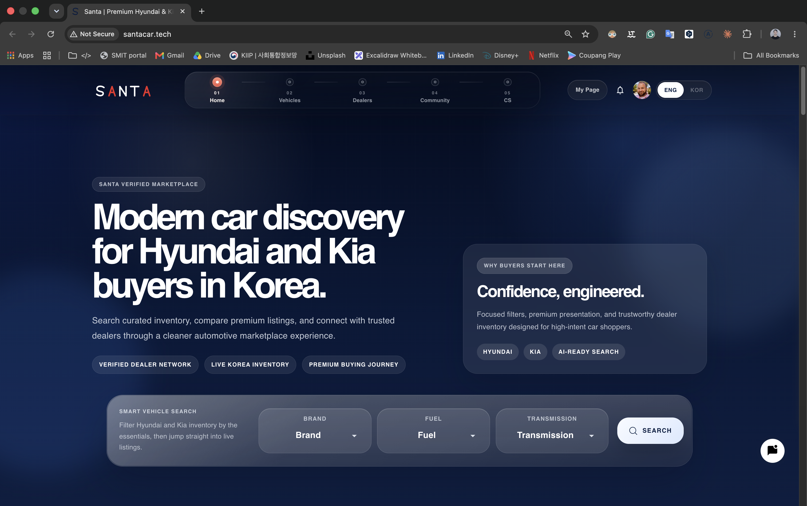
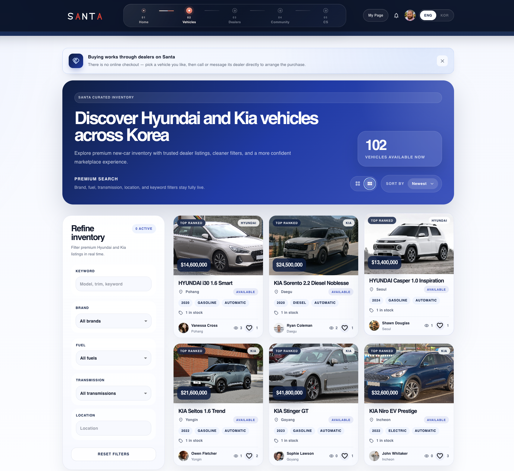
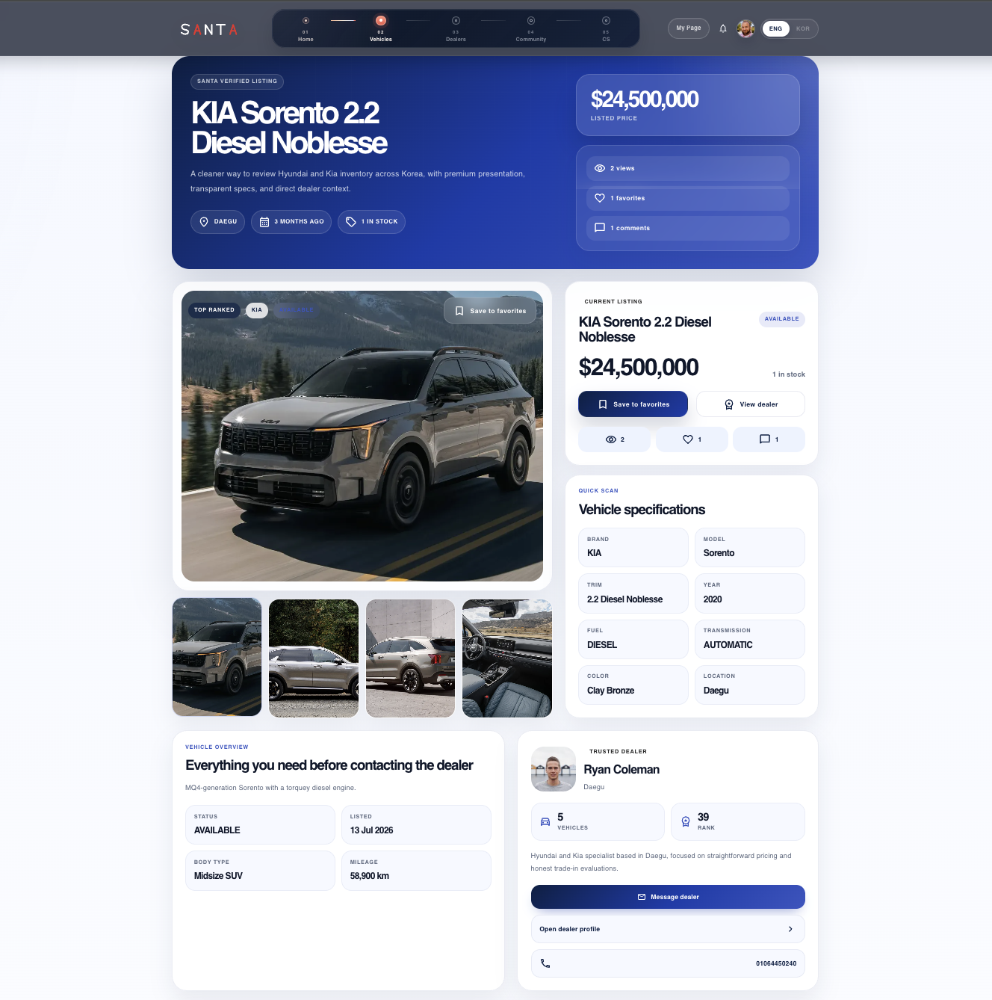
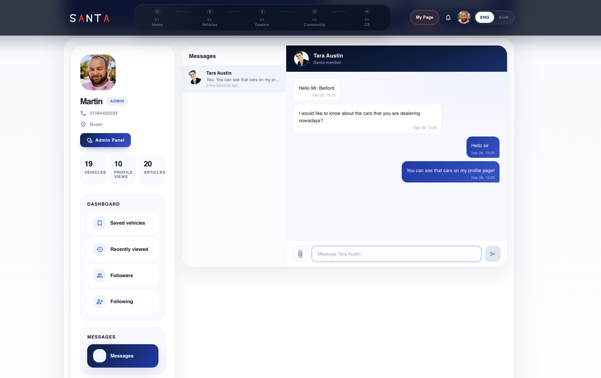
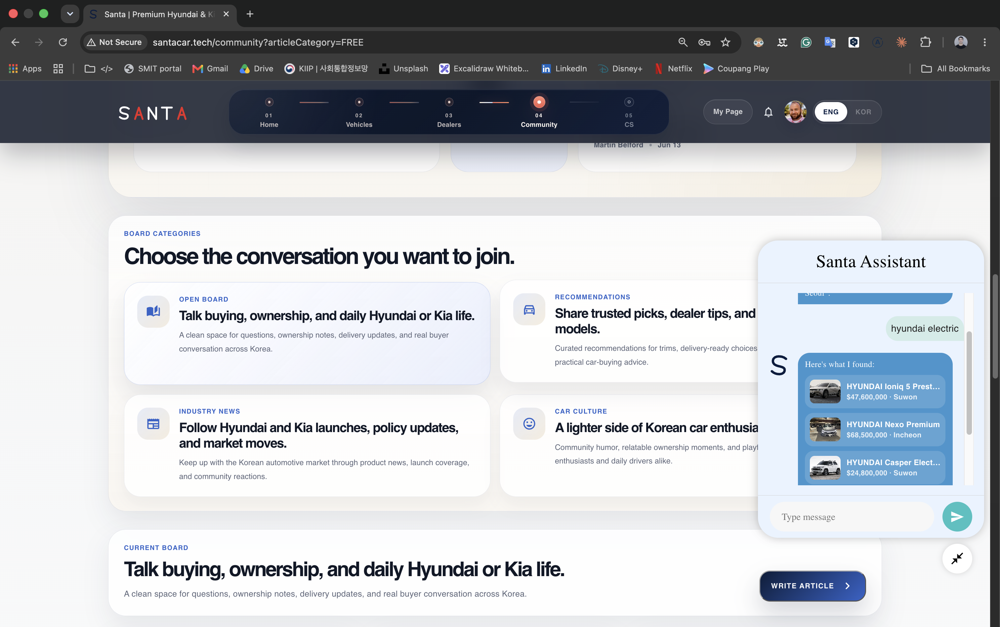
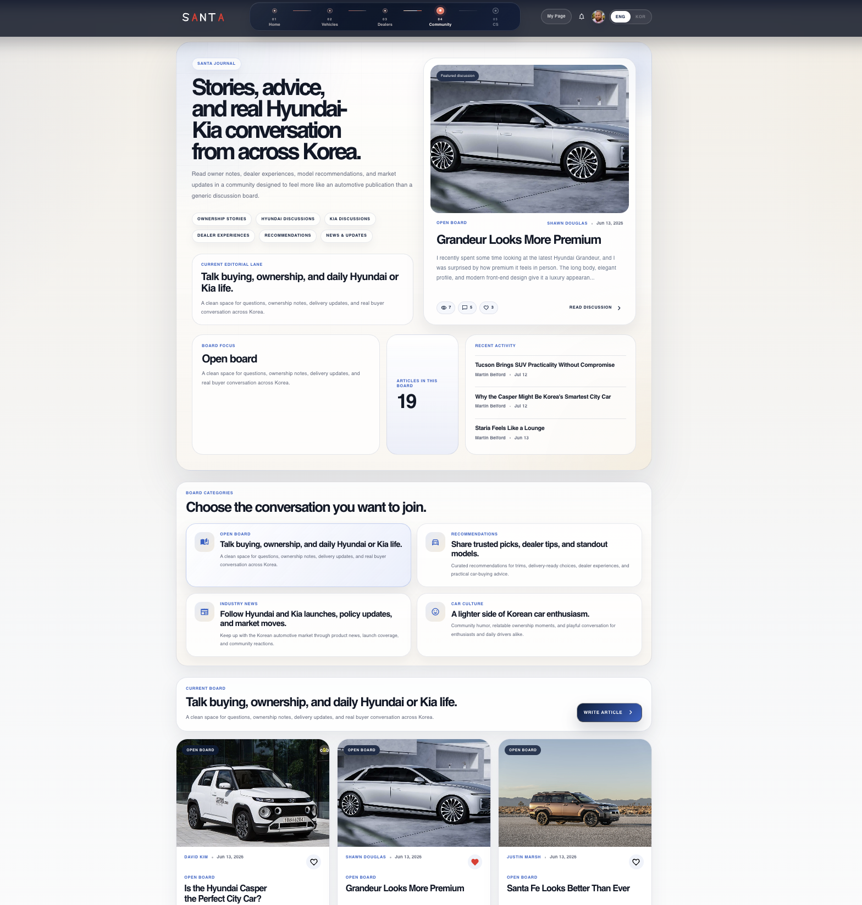
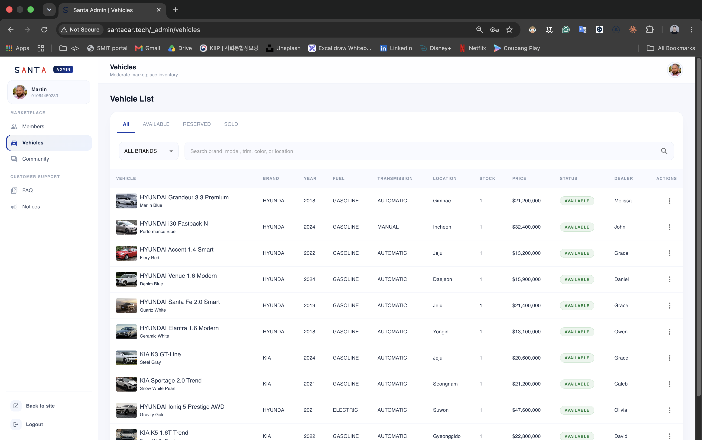
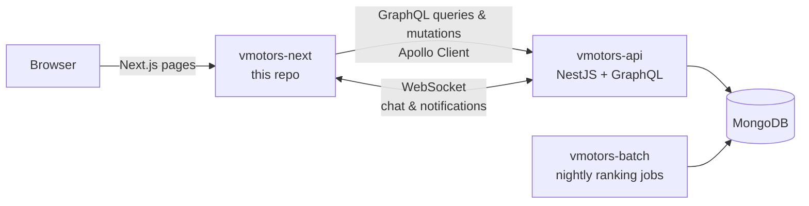

<div align="center">

# Santa

**An online marketplace for new Hyundai and Kia cars in South Korea.**

Buyers browse and compare cars, dealers manage their listings, and everyone can chat in real time.

Next.js + Apollo Client storefront · NestJS + GraphQL API · MongoDB · WebSocket

### [▶ Live demo: santacar.tech](http://santacar.tech) · [Backend repository](https://github.com/khodiboev/vmotors)




</div>

## Overview

Santa is a full-stack car marketplace with three kinds of users:

- **Buyers** search the catalog, like and compare cars, leave comments, follow dealers and message them directly.
- **Dealers** publish and manage their own vehicle listings, write community articles and answer buyers in real time.
- **Admins** moderate members, vehicles, community posts, notices and FAQs from a built-in admin panel.

It is my largest project. It started from a real-estate marketplace template from a course (*Nestar*) and was rebuilt module by module into a car marketplace: new domain models (brand, model, trim, fuel, transmission…), new pages, a redesigned home page, a real-time chat, a rule-based search assistant, English/Korean localization and deployment to my own server with Docker and Nginx.

This repository is the **frontend**. The GraphQL API and the scheduled ranking jobs live in [khodiboev/vmotors](https://github.com/khodiboev/vmotors).

## Screenshots

| Vehicle catalog with filters | Vehicle detail |
|---|---|
|  |  |

| Real-time messages | Santa Assistant |
|---|---|
|  |  |

| Community | Admin panel |
|---|---|
|  |  |

## Features

**Catalog and search**
- Vehicle catalog with filters by **brand, fuel type, transmission, location and price range**, plus text search, sorting and pagination
- Vehicle detail page with image gallery, specifications, comments, related cars and a "message the dealer" button
- **Likes** with optimistic UI updates and **view counting**; "Recently visited" and "My favorites" lists

**Real-time communication**
- **Direct messages** between buyers and dealers, with conversation list, unread counters and file attachments
- **Live notifications** pushed over WebSocket (new messages, likes, comments)
- A chat widget with **Santa Assistant** — a rule-based helper that understands brand and fuel keywords in a question and suggests matching cars (not an LLM)

**Dealers and community**
- Dealer directory and dealer profile pages with their listings; follow / unfollow dealers
- Dealer dashboard (My Page): add and edit vehicles, profile settings, favorites, recently visited, articles and messages
- Community forum with a WYSIWYG editor (Toast UI), likes and comments
- Notices and FAQ pages

**Home page**
- 3D **orbital carousels** for new arrivals and buyer favorites (with a reduced-motion fallback), brand section, top dealers, community highlights and trust / call-to-action sections

**Admin panel** (`/_admin`)
- Manage members (status, role), vehicles, community articles, notices, FAQs and inquiries

**Other**
- **English and Korean** interface (`next-i18next`)
- Responsive layout with separate mobile components

## Architecture



- **GraphQL** for all data: the frontend asks for exactly the fields each page needs.
- **Apollo Client** handles caching, file uploads (`apollo-upload-client`) and the JWT in request headers.
- **Global state** uses Apollo **reactive variables** (the logged-in user, UI state) instead of Redux, so server data and client state live in one place.
- **WebSocket** (native `ws`) carries direct messages and live notifications; the connection is authenticated with the same JWT.

## Frontend structure

```
pages/                     Next.js pages router
├── index.tsx              home page
├── vehicle/               catalog and vehicle detail
├── agent/                 dealer directory and dealer profile
├── community/             forum list and article detail
├── mypage/                personal dashboard (listings, messages, favorites…)
├── member/                public member profile
├── cs/                    notices and FAQ
├── account/join.tsx       sign up / log in
└── _admin/                admin panel
apollo/                    Apollo Client setup, GraphQL queries and mutations
libs/
├── components/            UI components grouped by page (homepage, vehicle-list, mypage, admin…)
├── auth/                  login, signup, token handling
├── hooks/  enums/  types/ shared logic and types
scss/                      styles (desktop and mobile)
public/locales/{en,kr}/    translations
```

The old `/property` routes from the template redirect to `/vehicle`, so existing links keep working.

## Tech stack

| Area | Technologies |
|---|---|
| Framework | Next.js (pages router), React, TypeScript |
| Data | Apollo Client, GraphQL, reactive variables, apollo-upload-client |
| Real-time | Native WebSocket |
| UI | MUI, SCSS, Framer Motion, Swiper, Toast UI Editor |
| i18n | next-i18next (English, Korean) |
| Backend (separate repo) | NestJS, GraphQL (Apollo Server), MongoDB / Mongoose, JWT, `@nestjs/schedule` |
| Deployment | Ubuntu VPS, Docker Compose, Nginx, custom domain |

## Run locally

Requirements: Node.js 20 and the [backend](https://github.com/khodiboev/vmotors) running.

```bash
git clone https://github.com/khodiboev/vmotors-next.git
cd vmotors-next
yarn install
```

Create `.env.local`:

```
NEXT_PUBLIC_API_URL=http://localhost:3007
NEXT_PUBLIC_API_GRAPHQL_URL=http://localhost:3007/graphql
NEXT_PUBLIC_API_WS=ws://localhost:3007
```

```bash
yarn dev          # http://localhost:3000
```

`NEXT_PUBLIC_*` variables are baked into the build, so set them before `yarn build`.

## Deployment

Frontend, API and batch server run as three Docker containers on one Ubuntu VPS, behind an Nginx reverse proxy on the `santacar.tech` domain:

| Container | Port (host → container) |
|---|---|
| santa-next | 4000 → 3000 |
| vmotors-api | 4001 → 3007 |
| vmotors-batch | 4002 → 3008 |

## Author

**Jurabek (Juno) Khodiboev** — full-stack developer in Seoul
[LinkedIn](https://www.linkedin.com/in/jurabek-khodiboev-4bab4427b) · [GitHub](https://github.com/khodiboev) · [Ask my AI assistant](https://ask.santacar.tech)
